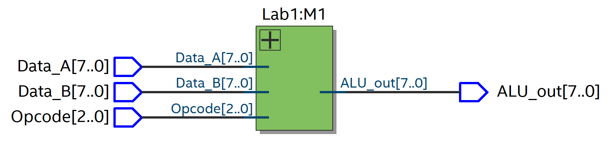
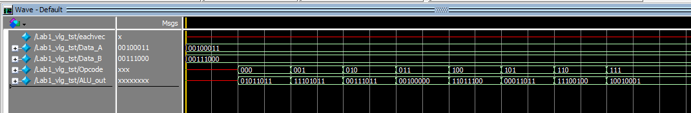

# Lab 1 Report - 8-bit Simple ALU

[TOC]


## Lab Targets

Design an 8-bit Arithmetic Logical Unit (ALU), based on the method of top-down module system design.

The functions are shown in the table, and eight operations such as addition, subtraction, logical AND, and OR are implemented according to the operation code.

The input operand is an 8421 code combination corresponding to a four-digit number starting from the end of the student number.

| Operand  |        Function        |
| :------: | :--------------------: |
|   Add    |         $a+b$          |
| Subtract |         $a-b$          |
|  Or_AB   |  $a \space| \space b$  |
|  And_AB  | $a \space \& \space b$ |
|  Not A   |        $\sim a$        |
|   Exor   |      $a \wedge b$      |
|  Exnor   |   $a \sim \wedge b$    |
|  Ror_A   |      $| \space a$      |

## Circuit Diagram

### Steps to Generate Circuit Diagram

Step1: Processing > start > Analysis & Elaboration
Step2: Tools > Netlist viewer > RTL viewer 

### Diagram



## Code and Comments

### ALU - Lab1.v

```verilog
module Lab1(output reg [7:0] ALU_out, input [7:0] Data_A, Data_B, input [2:0] Opcode);
	parameter	Add			= 3'b000,	//	A + B
				Subtract	= 3'b001,	//	A - B
				Or_AB		= 3'b010,	//	A | B
				And_AB		= 3'b011,	//	A & B
				Not_A		= 3'b100,	//	~ A
				Exor		= 3'b101,	//	A ^ B
				Exnor		= 3'b110,	//	A ~ ^ B
				Ror_A		= 3'b111;	//	| A

	always@(*)
	
	case(Opcode)
		Add:		ALU_out =  Data_A + Data_B;
		Subtract:	ALU_out =  Data_A - Data_B;
		Or_AB:		ALU_out =  Data_A | Data_B;
		And_AB:		ALU_out =  Data_A & Data_B;
		Not_A:		ALU_out =  ~ Data_A;
		Exor:		ALU_out =  Data_A ^ Data_B;
		Exnor:		ALU_out =  Data_A ~^ Data_B;
		Ror_A:		ALU_out <= {Data_A[0],Data_A[7:1]};
	endcase
endmodule
```

This model named Lab1, has one input port and three output ports. Which are

1. ALU_out: A 8-bit output, which is result of number after ALU process.
2. Data_A: A 8-bit input, the first data be sent to ALU.
3. Data_B: A 8-bit input, the second data be sent to ALU.
4. Opcode: A 3-bit input, to control the ALU function.

We declare 8 parameters for identifying 8 operations respectively. The details are described in the following table.

| Operation |        Function        |  Opcode   | Operation | Function | Opcode |
| :-------: | :--------------------: | :-------: | :-------: | :------: | :----: |
|    Add    |         $a+b$          | 000 | Not A | $\sim a$ | 100 |
| Subtract  |         $a-b$          | 001 | Exor | $a \wedge b$ | 101 |
|   Or_AB   |       $a \space | \space b$       | 010 | Exnor | $a \sim \wedge b$ | 110 |
|  And_AB   | $a \space \& \space b$ | 011 | Ror_A |          $| \space a$| 111 |

In line 11, `always@(*)` statement *always* here to tell that the following codes always run.

Start at line 13 is case statement, which is used to define the functions of each operation in details.

## Testbench and Wave

### Testbench - Lab1.vt

```verilog
module Lab1_vlg_tst();
// test vector input registers
reg [7:0] Data_A;
reg [7:0] Data_B;
reg [2:0] Opcode;
// wires                                               
wire [7:0]  ALU_out;

// assign statements (if any)                          
Lab1 i1 (
// port map - connection between master ports and signals/registers   
	.ALU_out(ALU_out),
	.Data_A(Data_A),
	.Data_B(Data_B),
	.Opcode(Opcode)
);
initial                                                
begin                                                  
// code that executes only once                        
// insert code here --> begin                          
	Data_A = 8'b00100011;
	Data_B = 8'b00111000;
	
	#20 Opcode = 3'b000;
	#20 Opcode = 3'b001;
	#20 Opcode = 3'b010;
	#20 Opcode = 3'b011;
	#20 Opcode = 3'b100;
	#20 Opcode = 3'b101;
	#20 Opcode = 3'b110;
	#20 Opcode = 3'b111;
// --> end                                             
$display("Running testbench");                       
end
endmodule
```

From *Experiments Handbook of Digital System Design* we know that the input operand is an 8421 code combination corresponding to a four-digit number starting from the end of the student number.

In this testbench, we use Student Number is 16206553, so the input number are 35~10~ and 56~10~
$$
35 _{10}=00100011 _2
$$

$$
56 _{10}=00111000 _2
$$

Then, we tested each opcode evey 20 ps.

### Wave



We can seen the output result are we expected.

## Resource Allocation

Shi Bo: All the Lab 1 is finished by Shi Bo.

## Summary

In this Lab, out team design a simple 8-bit ALU. Each of us participated in the experiment, completed the experiment together, and performed a simulation test. We successfully completed this experiment and the results are satisfactory.

# Source Code

## ALU - Lab1.v

```verilog
module Lab1(output reg [7:0] ALU_out, input [7:0] Data_A, Data_B, input [2:0] Opcode);
	parameter	Add		= 3'b000,	//	A + B
					Subtract	= 3'b001,	//	A - B
					Or_AB		= 3'b010,	//	A | B
					And_AB	= 3'b011,	//	A & B
					Not_A		= 3'b100,	//	~ A
					Exor		= 3'b101,	//	A ^ B
					Exnor		= 3'b110,	//	A ~ ^ B
					Ror_A		= 3'b111;	//	| A

	always@(*)
	
	case(Opcode)
		Add:			ALU_out =  Data_A + Data_B;
		Subtract:	ALU_out =  Data_A - Data_B;
		Or_AB:		ALU_out =  Data_A | Data_B;
		And_AB:		ALU_out =  Data_A & Data_B;
		Not_A:		ALU_out =  ~ Data_A;
		Exor:			ALU_out =  Data_A ^ Data_B;
		Exnor:		ALU_out =  Data_A ~^ Data_B;
		Ror_A:		ALU_out <= {Data_A[0],Data_A[7:1]};
	endcase
endmodule
```

## ALU Test Bench

```verilog
// Copyright (C) 2018  Intel Corporation. All rights reserved.
// Your use of Intel Corporation's design tools, logic functions 
// and other software and tools, and its AMPP partner logic 
// functions, and any output files from any of the foregoing 
// (including device programming or simulation files), and any 
// associated documentation or information are expressly subject 
// to the terms and conditions of the Intel Program License 
// Subscription Agreement, the Intel Quartus Prime License Agreement,
// the Intel FPGA IP License Agreement, or other applicable license
// agreement, including, without limitation, that your use is for
// the sole purpose of programming logic devices manufactured by
// Intel and sold by Intel or its authorized distributors.  Please
// refer to the applicable agreement for further details.

// *****************************************************************************
// This file contains a Verilog test bench template that is freely editable to  
// suit user's needs .Comments are provided in each section to help the user    
// fill out necessary details.                                                  
// *****************************************************************************
// Generated on "10/25/2019 18:04:54"
                                                                                
// Verilog Test Bench template for design : Lab1
// 
// Simulation tool : ModelSim-Altera (Verilog)
// 
// *****************************************************************************
// My UCD Student Number is 16206553
// The input number are 35d and 56d.
// 0010 0011b and 0011 1000b.
// *****************************************************************************

`timescale 1 ps/ 1 ps
module Lab1_vlg_tst();
// constants                                           
// general purpose registers
reg eachvec;
// test vector input registers
reg [7:0] Data_A;
reg [7:0] Data_B;
reg [2:0] Opcode;
// wires                                               
wire [7:0]  ALU_out;

// assign statements (if any)                          
Lab1 i1 (
// port map - connection between master ports and signals/registers   
	.ALU_out(ALU_out),
	.Data_A(Data_A),
	.Data_B(Data_B),
	.Opcode(Opcode)
);
initial                                                
begin                                                  
// code that executes only once                        
// insert code here --> begin                          
	Data_A = 8'b00100011;
	Data_B = 8'b00111000;
	
	#20 Opcode = 3'b000;
	#20 Opcode = 3'b001;
	#20 Opcode = 3'b010;
	#20 Opcode = 3'b011;
	#20 Opcode = 3'b100;
	#20 Opcode = 3'b101;
	#20 Opcode = 3'b110;
	#20 Opcode = 3'b111;
// --> end                                             
$display("Running testbench");                       
end                                                    
always                                                 
// optional sensitivity list                           
// @(event1 or event2 or .... eventn)                  
begin                                                  
// code executes for every event on sensitivity list   
// insert code here --> begin                          
                                                       
@eachvec;                                              
// --> end                                             
end                                                    
endmodule

```

