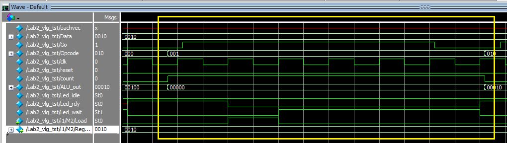

# Lab 2 Report -  Design and Simulation of ALU with sequential machine controlled datapath

## Lab Targets

Design an 8-bit Arithmetic Logical Unit (ALU), based on the method of top-down module system design.

Use the simple ALU from the previous experiment and write other circuits to complete the circuit design and test code writing. Under the EDA platform - ModelSim, complete the design input, compilation, and functional simulation verification.

## Circuit Diagram

### Steps to Generate Circuit Diagram

Step1: Processing > start > Analysis & Elaboration
Step2: Tools > Netlist viewer > RTL viewer 

### Diagram


## Code and Comments

### Top Model - Lab2.v

```verilog
module Lab2 (
	output [4:0] ALU_out,
	output Led_idle, Led_wait, Led_rdy,
	input [3:0] Data,
	input [2:0] Opcode,
	input Go,
	input clk,reset
);
	wire [3:0] Reg_out;
	
	ALU			    M1 (ALU_out, Data, Reg_out, Opcode);
	Register	    M2 (Reg_out, Data, Load, clk, reset);
	Toggle_Button	M3 (Load, Led_idle, Led_wait, Led_rdy, Go, clk, reset);
	
endmodule
```

This model named Lab1, has five input port and four output ports. Which are

1. ALU_out: A 5-bit output, which is result of number after ALU process.
2. Led_idel, Led_wait, Led_rdy: These three are LED to indicate the internal status of the system.
3. Data: A 4-bit input, the data be sent to ALU.
4. Opcode: A 3-bit input, to control the ALU function.
5. Go: It is a button to control the system.
6. clk: A clock signal.
7. reset: Hardware reset.

### ALU - Lab1.v

This part using the same design in Lab 1.

### Register - Register.v

```verilog
module Register (output reg [3:0] Reg_out, input [3:0] Data, input Load, clk, reset);
	always @(posedge clk) begin
	
		if(reset) Reg_out = 4'b0;
		else begin
			if(Load) Reg_out <= Data ;
		end
	end
endmodule
```

This model named Register. Having 5 ports.

1. Reg_out: One 4-bit register type output,  sending the data to ALU model.
2. Data: One 4-bit input, sending the data in the register.
3. Load: When **load** is HIGH, the data can write into the register. When load is LOW, the data can read out of the register.
4. clk: Clock signal.
5. reset: When **reset** is HIGH, the content of the register should be empty.

Line 2: Statement `always` here to tell that the following codes always at the positive edges of the clock signal, clk.

Line 4: If **reset** signal is HIGH, then clears the register. In our implementation, sending zero to output directly.

Line 5 to Line 7: If **reset** signal is LOW and **Load** signal is HIGH, sending input data to Reg_out. According to behaver of Register model are controlled by clock, the data will keeping in one clock cycle.

### Toggle Bottom - Toggle_Bottom.v

```verilog
module Toggle_Button (output reg Load, Led_idle, Led_wait, Led_rdy, input Go, clk, reset);
	reg [1:0] state = 0;
	
	always @(posedge clk) begin
	
		if(reset) state = 0;
		else begin
			if(Go && state == 0) state = 2'b1;
			else if(state == 1) state = 2'b10;
			else if(!Go && state == 2'b10) state = 2'b11; 
			else if (Go && state == 2'b11) begin
				state = 2'b1;
				Led_rdy = 0;
			end
		end

		case(state)
			2'b0:			begin
								Led_idle = 1;
								Led_wait = 0;
								Led_rdy = 0;
								Load = 0;
							end

			2'b1: 			begin
									Led_idle = 0;
									Load = 1;
							end

			2'b10:			begin
									Load = 0;
									Led_wait = 1;
								end

			2'b11:			begin
									Led_wait = 0;
									Led_rdy = 1;
								end
		endcase
	end
endmodule
```

This model named Register. Having 7 ports,

1. Load: One bit register type output, using for register model.
2. Led_idel, Led_wait, Led_rdy: These three are LED to indicate the internal status of the system.
3. Go: It is a button to control the system.
4. clk: Clock signal.
5. reset: When **reset** is HIGH, this model go to idle.

The following is flow chart of this model


Line 6: If **reset** signal is HIGH, the state of this model goes to initial state - S_idle. In our code, it is state 0.

Line 7 to Line 14: This part we using `if...else...` statements to control the state of this model, the state are following the above ASM chart. 

Line 17 to Line 39: This part is a `case` statement. Cooperating with state register in Line 2. For each state, this part statements used for control output ports.

## Testbench and Wave

### Testbench - Lab2.vt

```verilog
module Lab2_vlg_tst();
// constants                                           
// general purpose registers
reg eachvec;
// test vector input registers
reg [3:0] Data;
reg Go;
reg [2:0] Opcode;
reg clk;
reg reset;
reg count;
// wires                                               
wire [4:0]  ALU_out;
wire Led_idle;
wire Led_rdy;
wire Led_wait;

// assign statements (if any)                          
Lab2 i1 (
// port map - connection between master ports and signals/registers   
	.ALU_out(ALU_out),
	.Data(Data),
	.Go(Go),
	.Led_idle(Led_idle),
	.Led_rdy(Led_rdy),
	.Led_wait(Led_wait),
	.Opcode(Opcode),
	.clk(clk),
	.reset(reset)
);
initial                                                
begin                                                  
// code that executes only once                        
// insert code here --> begin                          

	clk = 0;
	
	Go = 0;
	reset =0;
	Data = 4'b0;
	Opcode = 3'b0;

	forever #5 clk = ~clk;
		
// --> end                                             
$display("Running testbench");                       
end                                                    

initial begin
#200 reset = 1;
#13 reset = 0;
end


always                                                 
// optional sensitivity list                           
// @(event1 or event2 or .... eventn)                  
begin                                                  
// code executes for every event on sensitivity list   
// insert code here --> begin                          

for(count = 3'b0 ; count<= 3'b111 ;count = count+1)
	begin
		Data = 4'b0010;
		#3 Go = 1;
		#50 Go = 0;
		#10 Opcode= Opcode + 1;
	end

@eachvec;                                              
// --> end                                             
end                                                    
endmodule
```

### Wave


We using one operation explain in detail.



From the above figure we can see that **Data** is 0010, **Reg_out** which is last data in register is 0010, and **Opcode** is 001 which function is subtract.

When **Go** signal is HIGH, in the next clock, **Led_rdy** from HIGH to LOW, at the same time, **Load** is from LOW to HIGH, to control the register store the data.

After next clock, **Load** signal becomes LOW, and **Led_wait** becomes HIGH, it is meaning the system is waiting to start calculate.
$$
    0010 _{2}-0010 _{2}=00000 _{2}
$$


We can seen the output is 00000, it is correct.

#### Reset function


From the wave figure we can seen after **reset** is HIGH, in next positive edge of clock, **Reg_out** is 0000, **Load** is LOW, **Led_idle** is HIGH, and **ALU_out** is 00000.

This result is our expected.