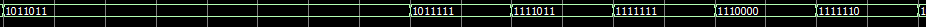

# Lab 3 Report - Design of the Taxi Meter

[TOC]


## Lab Targets

This lab will design a taxi meter. The detailed functions are following.

The starting price is 13 yuan, and the first three kilometres are the starting price range. The distance cost is not calculated separately, but the low-speed driving fee is still charged.

When the distance is bigger than 3km, the money adds 2.3 yuan every kilometre. 

When the money is bigger than 50 yuan, the money of every kilometre becomes 3.3 yuan per kilometre.

If the taxi in low speed status, every 5 minutes will adds 2.3 yuan to total cost.

There are three states. ‘start’, ‘stop’ and ‘pause’. ‘start’ means money sets to initial state and distance increases from zero. ‘stop’ means that money and distance is becomes zero. When the car pauses, do not count money and distance for this time.

The distance is showing on 5 7-segment LEDs, which has two decimal places and money showing on 4 7-segment LEDs which has one decimal place.

## Circuit Diagram


## Code and Testbench

### Top Module Design and Code

```verilog
module Lab3(pause, start, stop, clk, wheel_clk, clk2, display, scan, dp);
	input pause, start, stop, clk, wheel_clk, clk2;
	output [6:0] display;
	output [8:0] scan;
	output dp;
	wire low_speed, high_speed, pause_state, stop_state;
	wire [16:0] low_time, distance, distance_out, money;
	
	taxi_control T1 (.pause(pause), .start(start), .stop(stop), .clk(clk), .wheel_clk(wheel_clk), 
	.low_speed(low_speed), .high_speed(high_speed), .pause_state(pause_state), .stop_state(stop_state));
	
	taxi_distance_ptime T2 (.low_speed(low_speed), .high_speed(high_speed), .pause_state(pause_state), .stop_state(stop_state),
	.clk(clk), .wheel_clk(wheel_clk), .low_time(low_time), .distance(distance));
	
	taxi_money T3 (.stop_state(stop_state), .distance(distance), .low_time(low_time), .clk(clk),
	.distance_out(distance_out), .money(money));
	
	LED2s L1 (.distance_out(distance_out), .money(money), .display(display), .scan(scan), .dp(dp), .clk(clk), .clk2(clk2));

endmodule
```


### Control Module

#### Control Module Design and Code

In this module, we used the wheel speed(rad/s) to determine the speed of the taxi. We assume a sensor on the wheel, every time the wheel turns a cycle, we get a pulse in **wheel_clk**. All we need to do is count the number of turns the wheel has made in a given amount of time, and then divide the number of turns by that time, which is the speed of the wheel.

```verilog
module taxi_control(clk, wheel_clk, stop, start, pause, low_speed, high_speed, pause_state, stop_state);
	input clk, wheel_clk, stop, start, pause;
	output reg low_speed, high_speed, pause_state, stop_state;
	
	reg [4:0]clk_counter, wheel_counter;
	reg control;//判断是否经过固定时间
	reg [4:0]judge;

	initial begin
		clk_counter = 0;
		wheel_counter = 0;
		judge = 0;
		control = 0;
	end
```

The following are the meanings and uses of some variables:

1. clk_counter: Recording the number of posedge in **clk** (how many clock cycles have been went through).
2. wheel_counter: Recording the number of posedge in **wheel_clk** (how many times did the wheel turn).
3. control: Determine whether the number of goals of clock cycles(10, which I will introduce later) have passed or not. If true, set **control** to HIGH, else set **control** to LOW.
4. judge: Wheel speed.

```verilog
	always@(posedge clk)begin
		if(control) control = 0;
		clk_counter = clk_counter + 1;
		if(clk_counter == 10)begin 
			control = 1;
			clk_counter = 0;
		end	
	end


	always@(posedge wheel_clk)begin
		if(!control) wheel_counter = wheel_counter +1 ;
		else begin
			judge = wheel_counter;
			wheel_counter = 0;
		end
	end
```

Every time **clk_counter** goes up to 10, which is one second(as we set in this lab), we stop updating **wheel_counter** to read **wheel_counter**, which is equal to wheel speed(because the period is 1s). In this condition, judge is equal to **wheel_counter**. 

Finally, reset **clk_counter**, **wheel_counter**, and **control**, in order to get the wheel speed of next second.

```verilog
	always@(posedge clk)begin
		if(stop)begin
			low_speed = 0;
			high_speed = 0;
			pause_state = 0;
			stop_state = 1;
		end
		else if(start)begin
			stop_state = 0;
			if(pause)begin
				high_speed = 0;
				low_speed = 0;
				pause_state = 1;
			end
			else begin
				pause_state = 0;
				if(judge >= 10)begin
					low_speed = 0;
					high_speed = 1;
				end
				else begin
					high_speed = 0;
					low_speed = 1;
				end
			end
		end
	end
```

In this module, we set the speed at ten as the dividing line between low speed and high speed. If **judge** >= 10, we set high_speed to 1, else, we set low_speed to 1.

#### Control Module Testbench

```verilog
`timescale 1 ps/ 1 ps
module taxi_control_vlg_tst();
// constants                                           
// general purpose registers
reg eachvec;
// test vector input registers
reg clk;
reg pause;
reg start;
reg stop;
reg wheel_clk;
// wires                                               
wire high_speed;
wire low_speed;
wire pause_state;
wire stop_state;

// assign statements (if any)                          
taxi_control i1 (
// port map - connection between master ports and signals/registers   
	.clk(clk),
	.high_speed(high_speed),
	.low_speed(low_speed),
	.pause(pause),
	.pause_state(pause_state),
	.start(start),
	.stop(stop),
	.stop_state(stop_state),
	.wheel_clk(wheel_clk)
);
initial                                                
begin                                                  
// code that executes only once                        
// insert code here --> begin                          
	clk = 0;
	wheel_clk = 0;
	stop = 0;
	start = 1;
	pause = 0;
	forever #50 clk = ~clk;
// --> end                                             
$display("Running testbench");                       
end

initial
begin
	#4000 stop = 1;
			start = 0;
	#8000 stop = 0;
			start = 1;
			pause = 1;
end

always                                                 
// optional sensitivity list                           
// @(event1 or event2 or .... eventn)                  
begin                                                  
// code executes for every event on sensitivity list   
// insert code here --> begin                          
	for(i=0;i<10;i=i+1)
		begin
			#100 wheel_clk = ~wheel_clk;
		end
	
	for(i=0;i<20;i=i+1)
		begin
			#50 wheel_clk = ~wheel_clk;
		end
@eachvec;                                              
// --> end                                             
end                                                    
endmodule
```

At first, we using two loop to generate wheel pules, the first loop is testing low speed function. The second loop is testing normal (high speed) function.

The initial value of low_speed is 1. In first loop, judge = 5 < 10, low_speed = 1. In second loop, judge = 20 > 10, so since 10 clock cycles after 3000ps(4000ps), high_speed turns to 1.


Then, we testing *stop*, *start*, and *pause* function, the wave as following:


All information changes are correctly displayed on the waveform.

### Distance Calculation Module

#### Distance Calculation Design and Code

```verilog
module taxi_distance_ptime(high_speed, low_speed, pause_state, stop_state, wheel_clk, clk, distance, low_time);
	input high_speed, low_speed, pause_state, stop_state, wheel_clk, clk;
	output reg [16:0] low_time, distance;
	
	reg [4:0] wheel_counter2;
	reg [19:0] clk_counter2; //low speed time

	initial begin
		low_time = 0;
		distance = 0;
		wheel_counter2 = 0;
		clk_counter2 = 0;
	end
```

This module named `taxi_distance_ptime`, has six input ports and two output ports.

1. high_speed:
2. low_speed: This signal from control module, when taxi in low speed status this signal is HIGH, otherwise is LOW.
3. pause_state: When this signal is HIGH, taxi meter not calculate any money and distance.
4. stop_state: When this signal is HIGH, it means that the passenger has got off and the amount and mileage will be cleared.
5. wheel_clk: This signal will generate a high level every time the wheel makes one turn. We use this signal to calculate the speed of the vehicle.
6. clk: Clock signal.
7. low_time: 32-bit register type output, which is taxi low speed time.
8. distance: 32-bit register type output, which is distance of taxi.

There are two intermediate variables named **wheel_counter2** and **clk_counter2**. The first variable is used to calculate how many laps the wheel has traveled, and the second variable is used to measure the low speed of the taxi.

At the initial state, we will set all variables as 0.

```verilog
always@(posedge wheel_clk or posedge stop_state)begin
   if(stop_state) begin 
		distance = 0;
		wheel_counter2 = 0;
	end
	else begin
		if(!pause_state)begin
			wheel_counter2 = wheel_counter2 + 1;
				if(wheel_counter2 == 10)begin //10圈轮子7米
					distance = distance + 7;
					wheel_counter2 = 0;
				end
		end
	end
	
end
```

This part used for calculate distance. If the **stop_state** signal is HIGH, indicating that the taxi is not carrying passengers, we will clear the **distance** and **wheel_counter2**.

When the taxi is not in pause mode, **wheel_counter2** calculates the number of laps the wheel has turned. We specify that the wheel has turned 10 times and the car travels 7 meters. When **wheel_counter2** reaches 10, we add 7 to the **distance** and clear **wheel_counter2**.

```verilog
always@(posedge clk or posedge stop_state)begin
	if(stop_state)begin
		low_time = 0;
		clk_counter2 = 0;
	end
	else begin
		if(low_speed) clk_counter2 = clk_counter2 + 1;
		low_time = clk_counter2/100; //100个cycle是1分钟
	end
end
endmodule
```

This part used for calculate low speed time. If the **stop_state** signal is HIGH, indicating that the taxi is not carrying passengers, we will clear the **low_time** and **clk_counter2**.

When **low_speed** signal is HIGH, which means taxi has low speed, **clk_counter2** will add 1 each clock cycle. We specify that 100 clock cycles is 1 minutes. So, low time is equal to **clk_counter2** divided by 100.

#### Distance Calculation Module Testbench

```verilog
`timescale 1 ps/ 1 ps
module taxi_distance_ptime_vlg_tst();
// constants                                           
// general purpose registers
reg eachvec;
// test vector input registers
reg clk;
reg high_speed;
reg low_speed;
reg pause_state;
reg stop_state;
reg wheel_clk;
// wires                                               
wire [16:0]  distance;
wire [16:0]  low_time;

// assign statements (if any)                          
taxi_distance_ptime i1 (
// port map - connection between master ports and signals/registers   
	.clk(clk),
	.distance(distance),
	.high_speed(high_speed),
	.low_speed(low _speed),
	.low_time(low_time),
	.pause_state(pause_state),
	.stop_state(stop_state),
	.wheel_clk(wheel_clk)
);
initial                                                
begin                                                  
// code that executes only once                        
// insert code here --> begin                          
clk = 0;
stop_state = 0;
pause_state = 0;
low_speed = 0;
high_speed = 1;
forever #5 clk = ~clk;

// --> end                                             
$display("Running testbench");                       
end

initial begin
wheel_clk = 0;
forever #10 wheel_clk = ~wheel_clk;
end

always                                                 
// optional sensitivity list                           
// @(event1 or event2 or .... eventn)                  
begin                                                  
// code executes for every event on sensitivity list   
// insert code here --> begin                          
#400 pause_state = 1;
#200 pause_state = 0;
#400 low_speed = 1;
#400 low_speed = 0;
#200 stop_state = 1;
#100 stop_state = 0;
#400 pause_state = 1;
#200 pause_state = 0;
#400 low_speed = 1;
#400 low_speed = 0;
@eachvec;                                              
// --> end                                             
end                                                    
endmodule
```

The initial state of testbench is highspeed mode. At the first 400 clock cycle, the taxi running in the high speed mode.


We can seen from the waveform, in each clock cycle, the **wheel_counter2** increasing 1, and after 10 clock cycle, the **wheel_counter2** will form 0 to 9, the system will cleaning this variable and increase **distance** 7 meters.

Then, we tested pause function,


In this part, we set signal **pause_state** as HIGH, an we can seen the other variables such as distance, **wheel_counter2**, and **clk_counter2** not changed. It is correct.

We also set siganl **low_speed** as HIGH.


We can seen the variable **clk_counter2** is incensement each clock cycle.

At least, we give a stop signal,


All variables became zero and stat to counting distance for zero.

All faction are working correct, which is our expected.

### Price Calculation Module

#### Price Calculation Design and Code

In our design, the taxi_money module is used to calculate the current money required to pay by passengers. 

The **input signals** to this module are:

- clk: Used for timing and synchronization of all the modules in our design.
- distance: Current distance travelled, used for calculating the money.
- low_time: It is the total amount of time that the speed of the taxi is less than a certain value, the threshold value if specified in taxi_control module.
- stop_state: Indicating passenger has arrived the desired place and be ready for the next passenger, in this case, the record of distance and money should be clear.

The output signals to this module are:

- distance_out: A copy of distance which will be used by other modules.
- money: Current money required to pay.

Then it is necessary to declare the rules of how much money should be paid for:

1. The starting price is 13 RMB.

2. Within 3km, no need to pay more money, however the passenger need to pay more for low_speed driving fee specified by low_time if necessary.

3. Every 5 minutes in low_speed driving, the input low_time will increase 1 and need extra 2.3 RMB

4. If the current fee is less than 50 RMB, 2.3RMB per km (excluding the first three km). If the current fee is greater than 50RMB, 3.3RMB per km.

Importance: In the design of taxi_money module, all values related to money and fees are multiplied by a factor of 10 since the last digit of the value is used for representing the decimal part of 1 digit. For example, if the money represented in the design is 776, it means 77.6RMB.

```verilog
module taxi_money(distance, low_time, clk, stop_state, distance_out, money);
	input [16:0] distance, low_time;
	input clk, stop_state;
	output reg [16:0] distance_out, money;
	reg [16:0] money_low, distance_50, money_50;
	
	initial begin
		distance_out = 0;
		money = 0;
		money_low = 0;
	end
```

We define three intermediate variables named **money_low**, **distance_50** and **money_50** respectively. **money_low** records the total extra money needed for driving in low speed, **distance_50** is a constant indicates the distance traveled when the current money is 50RMB (including the fee of money_low), and **money_50** is a constant indicates the money exclude the money_low when the current actual money is 50RMB. 

Then we setting the initial value of output to all 0s.

```verilog
	always@(posedge clk or posedge stop_state)begin
		if(stop_state)begin
			distance_out = 0;
			money = 0;
			money_low = 0;
		end
		else begin
			money_low = low_time*23;
			distance_out = distance;
			if(distance <= 3000)begin
				money = 130 + money_low;
			end
			else begin
				if(money < 500)begin
					money = (23*((distance-3000)/1000)) + 130 + money_low;
					distance_50 = distance;
					money_50 = (23*((distance-3000)/1000)) + 130;
				end
				else begin
					money = money_50 + (33*((distance-distance_50)/1000))+ money_low; 
				end
			end
		end
	end
endmodule
```

In the above code segment:

In line 2 - 6, considering the case of stop state, the distance and all money shold be clear to welcome next passenger. In our design, the stop_state is asynchronous to the clock as shown in the condition in always (). 

In line 8, it is used to calculate the money for driving in low speed based on the input low_time.

In line 10 - 12, it is the case that when distance is less than 3km, only charge the initial price of 13RMB plus any fee for low_speed driving.

In line 14 - 18, showing a situation that the total money is less than 50RMB.

In line 20, showing a situation that the total money is greater than 50RMB.

#### Price Calculation Module Testbench

```verilog
`timescale 1ns/1ns
module t_taxi_money();
	reg clk, stop_state;
	reg [16:0] distance, low_time;
	wire [16:0] distance_out, money;
	parameter clkcycle = 1'd4;	

	taxi_money u1(.clk(clk), .stop_state(stop_state), .distance(distance), .low_time(low_time), .distance_out(distance_out), .money(money));

	
	initial begin
		distance = 32'b0;
		low_time = 32'b0;
		stop_state = 1'b0;
		clk = 0;
	end	
	always #4 clk = ~clk;
	
	initial #100 $finish;
	
	initial begin	
		#10 distance = 17'd2000;
		#10 distance = 17'd3500;
		#10 low_time = 17'd4;
		#10 distance = 17'd13000;
		#10 distance = 17'd16000;
		#10 distance = 17'd20000;
		#10 low_time = 17'd6;
		#10 stop_state = 1'b1;
		
	end
	initial $monitor($time," current distance: %d  currnet money: %d",distance, money);
	
endmodule
```


Initially, I set all the inputs signal to 0 and a clock cycle of 4. At the end, I use “monitor” to output all different value of money corresponding to any changes of input signals. 

Any changes to the input I test are declared below.

1. After 10 clock cycles: change the input distance to 2000 meters, the desired money output should be 130 (13RMB)

2. After 20 clock cycles: change the input distance to 3500 meters, the desired money output should also be 130 (13RMB), since less than 1km will not be charged.

3. After 30 clock cycles: change the value of low_time is 4, the desired money output should be 130+4*23=130+92=222(22.2RMB).

4. After 40 clock cycles: change the input distance to 13000 meters, the desired money output should be 130+(13-3)*23+4*23=452(45.2RMB).

5. After 50 clock cycles: change the input distance to 16000 meters, the desired money output should be 130+(16-3)*23+4*23=521(52.1RMB).

6. After 60 clock cycles: change the input distance to 20000 meters, since the money has already greater than 50RMB, then the desired money output should be 130+(16-3)*23+4*33+4*23=653(65.3RMB).

7. After 70 clock cycles: change the input distance to 20000 meters, since the money has already greater than 50RMB, then the desired money output should be 130+(16-3)*23+4*33+4*23=653(65.3RMB).

8. After 80 clock cycles: stop_state is 1 indicating end of the travel, the desired output money should be 0. 

The result using monitor is shown in the picture below.


By comparing the desired value and the result of simulation, the correctness of our module has been verified. 

Then the waveform of the testbench is also shown below: 


which is also shown a us an expected result.

### LED Module

#### LED Module Design and Code

In order to display the distance that the taxi moved during the trip, as well as the fare that passengers need to pay, we assign to utilize LEDs. it is noticeable that what we have designed is dynamic scanning LEDs.

```verilog
module LED2s(distance_out, money, display, scan, clk2, clk, dp);
	input [16:0] distance_out, money;
	input clk2, clk;//clk2 用来扫描 clk2要远远快于clk
	output reg [6:0] display;
	output reg [8:0] scan;
	output reg dp;
	reg [10:0] X1_distance, X2_distance, G_distance, S_distance,B_distance;
	reg [10:0] X1_money, G_money, S_money, B_money;
	reg [3:0] chos, data;
	
	parameter BLANK = 7'b0000000;
	parameter ZERO  = 7'b1111110;    
	parameter ONE   = 7'b0110000;    
	parameter TWO   = 7'b1101101;    
	parameter THREE = 7'b1111001;    
	parameter FOUR  = 7'b0110011;    
	parameter FIVE  = 7'b1011011;    
	parameter SIX   = 7'b1011111;    
	parameter SEVEN = 7'b1110000;    
	parameter EIGHT = 7'b1111111;    
	parameter NINE  = 7'b1111011;

	initial begin
		chos = 10;
		scan = 'b000000000;
		display = BLANK;
	end
    
	always@(posedge clk)begin
		X2_distance = distance_out%100/10;
		X1_distance = distance_out%1000/100;
		G_distance =  distance_out%10000/1000; //distance 米，要变成千米
		S_distance =  distance_out%100000/10000;
		B_distance =  distance_out%1000000/100000;
		
		X1_money = money%10;
		G_money = money%100/10;
		S_money = money%1000/100;
		B_money = money%10000/1000;
	end
```

We need 9 LEDs to demonstrate different places of the value of distance and money, for example **X2_distance** represents the second place after the decimal point, **X1_distance** represents the first place after the decimal point, **G_distance**----ones place, **S_distance**’---tens place, **B_distance**---hundreds place, which have the same meaning of **X1_money**, **G_money**, **S_money**, **B_money**.

Note: all of these variables I mentioned above(**X2_distance** **X1_distance** **G_distance** **S_distance**…….**B_money**) called intermediate variables.

As you can see in the code, there are four inputs---**distance_out**, **money**, **clk**, **clk2**. **distance_out** and **money** are used to indicate the actual distance as well as the actual fare needed to display, **clk** is used to control refreshing data----as the posedge of clk occurs the value of each intermediate variable discussed before will be refreshed. **clk2** is used to control dynamic scanning of LEDs----as the posedge of clk2 occurs the module will choose the next LED to show corresponding number ,thus ‘**clk2**’ is much faster than **clk**----at least it should satisfy that before the next posedge of clk (refreshing data), all of LEDs should display their value once. While, for the three outputs---**display**, **scan**, **dp**, “display” is used to output 7-segment decoding instructions corresponding with the number stored in each intermediate variable, “scan” is used to output the LED address utilizing 9-bit one-hot code form 000000001’b to 100000000’b and “dp” is used to display status of decimal point on the LED.

```verilog
	always@(data)begin
		case(data)
			0:begin display = ZERO; end
			1:begin display = ONE;  end
			2:begin display = TWO;  end
			3:begin display = THREE; end
			4:begin display = FOUR; end
			5:begin display = FIVE; end
			6:begin display = SIX;  end
			7:begin display = SEVEN;end
			8:begin display = EIGHT;end
			9:begin display = NINE; end
			default:begin display = BLANK; end
		endcase	
	end
	
	
	
	always@(posedge clk2)begin
		if(chos < 8) chos = chos + 1;
		else chos = 0;
	end
	
	always@(chos)begin
		case(chos)
			0:begin data = X2_distance;dp = 0;scan = 'b000000001; end 
			1:begin data = X1_distance;dp = 0;scan = 'b000000010; end
			2:begin data = G_distance;dp = 1;scan = 'b000000100;  end
			3:begin data = S_distance;dp = 0;scan = 'b000001000;  end
			4:begin data = B_distance;dp = 0;scan = 'b000010000;  end
			5:begin data = X1_money;dp = 0;scan = 'b000100000;    end
			6:begin data = G_money;dp = 1;scan = 'b001000000;     end
			7:begin data = S_money;dp = 0;scan = 'b010000000;     end
			8:begin data = B_money;dp = 0;scan = 'b100000000;     end
			default:begin data = 10;dp = 0;scan = 'b000000000;     end
		endcase
	end
endmodule
```

Variable **chos** and **data** can help us to determine which LED will be turned on and which number will be shown on LED.

If we want LEDs to show the correct number, corresponding 7-segment code need to be transferred to them exactly.

#### LED Module Testbench

In the testbench, the main mission is to check if LEDs can display the value we want and if the dynamic scanning can work perfectly, the code of testbench as shown below:

```verilog
`timescale 1ns/10ps
module LED2s_test();
reg [16:0] distance_out, money;
reg clk2,clk;
wire [8:0] scan; 
wire dp;
wire [6:0]display; 
LED2s L1 (distance_out, money, display, scan, clk2, clk, dp);

always begin
	#50 clk = ~ clk;
end

always begin
	#2 clk2 = ~ clk2;
end

initial begin
	clk = 0;
	clk2 = 0;
	distance_out = 12345;
	money = 6666;
	#200 distance_out = 78965;
	money = 5555;
	#350 $finish;
end

initial $monitor
($time,
"current distance: %d  current money: %d\n                    current LED: %b    current value: %b ",
distance_out, money, scan, display);

endmodule
```

The period of **clk** is 100ns---- 50ns high level, 50ns low level.

The period of **clk2** is 4ns---- 2ns high level, 2ns low level.

At first I assign the value of **distance_out** is 12345, the value of **money** is 6666.

After 200ns, their value change to 78965 and 5555 respectively.

The reason why I assign each bit of ‘money’ the same is because when I check the wave form figure, it is convenient for me to distinguish whether LEDs is showing the value of distance or showing the value of money.

For example:



The first part is showing the money, the following parts are showing the distance.

Monitor is used to display the value of each variable in script which will be more clear, because the figure is too long to read all values at the same time.

I will plot the wave form figure and results monitor showed:


As you can see, at first the distance is 12345, money is 6666, but each of the LED doesn’t show any value, this is because clk2 doesn’t meet posedge at that time, so the value of variables---‘**X1_distance**’, ‘**X2_distance**’and so on are “X”(undetermined), LEDs will display BLANK.

After 50ns, variables hold values, figures as shown below:


As we expected, all of the LEDs turn on and off one by one, showing the value of distance and money bit by bit with the correct number.

After 200ns, the value of distance and money change to 78965 and 5555, however, at that time the ‘**clk**’ is at low level, thus the value of each intermediate such as ‘**X1_distance**’ will not change. The figure as shown below:


After 250ns, the value of each intermediate variables change, and we get the correct answer:


### Top Module Testbench

*In order to quickly verify the functional correctness of the system, we changed some values of the judgment conditions in the final test. This will not affect the overall logic and structure of the system.*

```verilog
module t_taxi_top();
	reg pause, start, stop, clk, wheel_clk, clk2;
	wire [6:0] display;
	wire [8:0] scan;
	wire dp;
	integer i;
	
	Lab3 qm(.pause(pause),.start(start),.stop(stop),.clk(clk),.wheel_clk(wheel_clk),.clk2(clk2),.display(display),.scan(scan),.dp(dp));
	
	initial begin
		pause=1'b0;
		start=1'b0;
		stop=1'b1;
		clk=1'b0;
		wheel_clk=1'b0;
		clk2=1'b0;
	end
		always #50 clk=~clk;
		always #5 clk2=~clk2;
		always begin
			for(i=0;i<500;i=i+1)begin
			#4 wheel_clk=~wheel_clk;
			end
			for(i=0;i<20;i=i+1)begin
			#60 wheel_clk=~wheel_clk;
			end
		end
		
		
		initial begin
		#50   start = 1;
		      stop = 0;
		      pause = 0;	
		
		#1000 pause = 1;
		#100  pause = 0;
		#3000 stop = 1;
		end
		
		initial $monitor($time,"the display is: %d ,the scan is : %d ,the dp is : %d ",display,scan,dp);
		
endmodule
```

The top-level module detestbench is explained in detail.

```verilog
 always # 50 clk = ~ clk;
```


Here **clock** is a fixed clock and has remained the same. Delay 50 will flip, so his period is 100.

 ```verilog
always # 5 clk2 = ~ clk2;
 ```

Here **clock2** represents the clock of the scanning tube, which must be less than nine times the clock. We use 9 LED tubes to represent it, so we need to scan nine LED tubes in one clock cycle. In other words, every so many times, we have to change a digital tube. A total of 9 digital tubes have to be changed. No digital tube indicates a digit, and these 9 digital tubes indicate money and distance. Everything I have is represented with this big clock. I need to change the small clock at least 9 times in the clock to display a complete waveform.

Then, in order to distinguish between low-speed driving and high-speed driving, the pricing standards for low-speed driving and high-speed driving are different.

```verilog
		always begin
			for(i=0;i<500;i=i+1)begin
			#4 wheel_clk=~wheel_clk;
			end
			for(i=0;i<20;i=i+1)begin
			#60 wheel_clk=~wheel_clk;
			end
		end
```

Here, a clock that rolls over after 4 seconds indicates the state of high-speed driving. After 60 seconds, a clock occurs anyway, indicating a low-speed clock.Let the high-speed cycle total 2,000 seconds, there are 500 cycles, each time is 4s. That is, the first 500 cycles, let him output high-speed, there will be a high-speed pricing rule. Low speed is not performed during high speed driving so there is no low speed charge. Then we measured more than ten kilometers, we began to measure the price of low-speed driving, low-speed billing will go up.

We have three states, start, pause, and stop.

```verilog
		initial begin
		#50   start = 1;
		      stop = 0;
		      pause = 0;	
		
		#1000 pause = 1;
		#100  pause = 0;
		#3000 stop = 1;
		end
```

For the first 50 seconds, we set start to 1, which means the car started to run and started to charge. With a delay of 1000s, we set pause to 1, which means that the pricing table will not be cleared but the billing will stop. After setting stop to 1, the pricing table will be cleared.

The overall waveform diagram is like this.


Each bit of **scan** in the figure corresponds to a digital tube position. The value will be displayed on the display. 1 indicates that the corresponding digital tube is on, and 0 indicates that the digital tube is off, which corresponds to each number.

```verilog
	parameter BLANK = 7'b0000000;
	parameter ZERO  = 7'b1111110; 
	parameter ONE   = 7'b0110000;
	parameter TWO   = 7'b1101101;
	parameter THREE = 7'b1111001;
	parameter FOUR  = 7'b0110011;
	parameter FIVE  = 7'b1011011;
	parameter SIX   = 7'b1011111;
	parameter SEVEN = 7'b1110000;
	parameter EIGHT = 7'b1111111;
	parameter NINE  = 7'b1111011;
```

According to the billing standard, it does not exceed 3km, and we start at 13 yuan. Over 3km, less than 1km is not counted, 2 yuan per kilometer is charged for 3 yuan, the total price is more than 50 yuan, 3.3 yuan per kilometer is charged.

In this waveform chart, it means that we have walked 2100 meters and spent 13 yuan. Our 130 here means 13 yuan. The distance is 2100 meters, or 2.1 kilometres. Money is 13, which is 13.0.


Then our expected result is:

Money: `13.0`

Distance: `_ _ 02.1_`

| Display |   scan    |        | parameter |      |
| :-----: | :-------: | :----: | :-------: | :--: |
| 1111110 | 100000000 |  B_m   |   ZERO    |  0   |
|  blank  | 000000001 | X2_dis |   BLANK   |  /   |
| 0110000 | 000000010 | X1_dis |    ONE    |  1   |
| 1101101 | 000000100 | G_dis  |    TWO    |  2   |
| 1111110 | 000001000 | S_dis  |   ZERO    |  0   |
|  blank  | 000010000 | B_dis  |   BLANK   |  /   |
|  blank  | 000100000 |  X1_m  |   BLANK   |  /   |
| 1111001 | 001000000 |  G_m   |   THREE   |  3   |
| 0110000 | 010000000 |  S_m   |    ONE    |  1   |

As shown above, it is consistent with our expected results.

In this waveform chart, pause becomes 1, where the meter is suspended but the price remains the same, but the distance will continue to increase.


In this figure we can see that after pause is equal to 1, **clk** has experienced two rising clock edges. But money remains the same. Consistent with our expectations.


In this picture, the car is driving at a low speed. The penultimate waveform in the figure corresponds to the money generated in the low-speed driving state. 

After low speeds, the way money is calculated changes. We also add extra money for low speed driving. First of all, because we set the distance of 50 yuan to 18900 according to the pricing rules, and when the money reaches 47.5, we will use the price of 3.3 per kilometre. In this way, we can get the price of the part higher than 50 yuan. Finally add 2.3 yuan from low speed driving Finally, according to the calculation, we get
$$
47.5+3 \times(22400-18900) \div 1000 + 2.3=58.7
$$
Which is consistent with expectations.

## Resource Allocation

Liu Ziyang: Distance calculation module and testbench, the corresponding part of the experimental report , and other parts of lab report.

Xu Zhikun: Top module design and testbench, and the corresponding part of the experimental report.

Zhu Yanxing: LED module design and testbench, and the corresponding part of the experimental report.

Chen Dingrui: Price calculation module design and testbench, and the corresponding part of the experimental report.

Gong Chen: Control module design and testbench, and the corresponding part of the experimental report.

## Summary

In this lab, we analyzed the functional requirements of "taxi meter" and completed the Verilog HDL design description. Then we design the pricing function, vehicle running state simulation and other functions of the test program. Completed the preparation of Testbench and the simulation verification on the Modelsim platform.

# Source Code

## Top Module - Lab3.v

```verilog
module Lab3(pause, start, stop, clk, wheel_clk, clk2, display, scan, dp);
	input pause, start, stop, clk, wheel_clk, clk2;
	output [6:0] display;
	output [8:0] scan;
	output dp;
	wire low_speed, high_speed, pause_state, stop_state;
	wire [16:0] low_time, distance, distance_out, money;
	
	taxi_control T1 (.pause(pause), .start(start), .stop(stop), .clk(clk), .wheel_clk(wheel_clk), 
	.low_speed(low_speed), .high_speed(high_speed), .pause_state(pause_state), .stop_state(stop_state));
	
	taxi_distance_ptime T2 (.low_speed(low_speed), .high_speed(high_speed), .pause_state(pause_state), .stop_state(stop_state),
	.clk(clk), .wheel_clk(wheel_clk), .low_time(low_time), .distance(distance));
	
	taxi_money T3 (.stop_state(stop_state), .distance(distance), .low_time(low_time), .clk(clk),
	.distance_out(distance_out), .money(money));
	
	LED2s L1 (.distance_out(distance_out), .money(money), .display(display), .scan(scan), .dp(dp), .clk(clk), .clk2(clk2));

endmodule
```

## Control Module - taxi_control.v

```verilog
module taxi_control(clk, wheel_clk, stop, start, pause, low_speed, high_speed, pause_state, stop_state);
	input clk, wheel_clk, stop, start, pause;
	output reg low_speed, high_speed, pause_state, stop_state;
	
	reg [6:0]clk_counter, wheel_counter;
	reg control;//判断是否经过固定时间
	reg [6:0]judge;

	initial begin
		clk_counter = 0;
		wheel_counter = 0;
		judge = 0;
		control = 0;
	end

	always@(posedge clk)begin
		if(control) control = 0;
		clk_counter = clk_counter + 1;
		if(clk_counter == 100)begin 
			control = 1;
			clk_counter = 0;
			judge = wheel_counter;
		end	
		
	end


	always@(posedge wheel_clk, posedge control)begin
		if(control) wheel_counter = 0;
		else wheel_counter = wheel_counter +1 ;
	end

	always@(posedge clk)begin
		if(stop)begin
			low_speed = 0;
			high_speed = 0;
			pause_state = 0;
			stop_state = 1;
		end
		else if(start)begin
			stop_state = 0;
			if(pause)begin
				high_speed = 0;
				low_speed = 0;
				pause_state = 1;
			end
			else begin
				pause_state = 0;
				if(judge >= 10)begin
					low_speed = 0;
					high_speed = 1;
				end
				else begin
					high_speed = 0;
					low_speed = 1;
				end
			end
		end
	end
endmodule

```

## Distance Calculation Module - taxi_distance_ptime.v

```verilog
module taxi_distance_ptime(high_speed, low_speed, pause_state, stop_state, wheel_clk, clk, distance, low_time);
	input high_speed, low_speed, pause_state, stop_state, wheel_clk, clk;
	output reg [16:0] low_time, distance;
	
	reg [4:0] wheel_counter2;
	reg [19:0] clk_counter2; //low speed time

	initial begin
		low_time = 0;
		distance = 0;
		wheel_counter2 = 0;
		clk_counter2 = 0;
	end
	
	//distance
	always@(posedge wheel_clk or posedge stop_state)begin
		if(stop_state) begin 
			distance = 0;
			wheel_counter2 = 0;
		end
		else begin
			if(!pause_state)begin
				wheel_counter2 = wheel_counter2 + 1;
				if(wheel_counter2 == 10)begin //10圈轮子7米
					distance = distance + 7;
					wheel_counter2 = 0;
				end
			end
		end
		
	end
	
	//low speed time
	always@(posedge clk or posedge stop_state)begin
		if(stop_state)begin
			low_time = 0;
			clk_counter2 = 0;
		end
		else begin
			if(low_speed) clk_counter2 = clk_counter2 + 1;
			low_time = clk_counter2/30000; //30000个cycle是5分钟
		end
	end
endmodule

```

## Price Calculation Module - taix_money.v

```verilog
module taxi_money(distance, low_time, clk, stop_state, distance_out, money);
	input [16:0] distance, low_time;
	input clk, stop_state;
	output reg [16:0] distance_out, money;
	reg [16:0] money_low, distance_50, money_50;
	
	initial begin
		distance_out = 0;
		money = 0;
		money_low = 0;
	end
	
	always@(posedge clk or posedge stop_state)begin
		if(stop_state)begin
			distance_out = 0;
			money = 0;
			money_low = 0;
		end
		else begin
			money_low = low_time*23;
			distance_out = distance;
			if(distance <= 3000)begin
				money = 130 + money_low;
			end
			else begin
				if(money < 500)begin
					money = (23*((distance-3000)/1000)) + 130 + money_low;
					distance_50 = distance;
					money_50 = (23*((distance-3000)/1000)) + 130;
				end
				else begin
					money = money_50 + (33*((distance-distance_50)/1000))+ money_low; 
				end
			end
		end
	end
endmodule

```

## LED Module - LED2.v

```verilog
module LED2s(distance_out, money, display, scan, clk2, clk, dp);
	input [16:0] distance_out, money;
	input clk2, clk;//clk2 用来扫描 clk2要远远快于clk
	output reg [6:0] display;
	output reg [8:0] scan;
	output reg dp;
	reg [10:0] X1_distance, X2_distance, G_distance, S_distance,B_distance;
	reg [10:0] X1_money, G_money, S_money, B_money;
	reg [3:0] chos, data;
	
	parameter BLANK = 7'b0000000;
	parameter ZERO  = 7'b1111110; 
	parameter ONE   = 7'b0110000;
	parameter TWO   = 7'b1101101;
	parameter THREE = 7'b1111001;
	parameter FOUR  = 7'b0110011;
	parameter FIVE  = 7'b1011011;
	parameter SIX   = 7'b1011111;
	parameter SEVEN = 7'b1110000;
	parameter EIGHT = 7'b1111111;
	parameter NINE  = 7'b1111011;

	initial begin
		chos = 10;
		scan = 'b000000000;
		display = BLANK;
	end
    
	always@(posedge clk)begin
		X2_distance = distance_out%100/10;
		X1_distance = distance_out%1000/100;
		G_distance =  distance_out%10000/1000; //distance 米，要变成千米
		S_distance =  distance_out%100000/10000;
		B_distance =  distance_out%1000000/100000;
		
		X1_money = money%10;
		G_money = money%100/10;
		S_money = money%1000/100;
		B_money = money%10000/1000;
	end
	
	always@(data)begin
		case(data)
			0:begin display = ZERO; end
			1:begin display = ONE;  end
			2:begin display = TWO;  end
			3:begin display = THREE; end
			4:begin display = FOUR; end
			5:begin display = FIVE; end
			6:begin display = SIX;  end
			7:begin display = SEVEN;end
			8:begin display = EIGHT;end
			9:begin display = NINE; end
			default:begin display = BLANK; end
		endcase	
	end
	
	
	
	always@(posedge clk2)begin
		if(chos < 8) chos = chos + 1;
		else chos = 0;
	end
	
	always@(chos)begin
		case(chos)
			0:begin data = X2_distance;	dp = 0;	scan = 'b000000001; end 
			1:begin data = X1_distance;	dp = 0;	scan = 'b000000010; end
			2:begin data = G_distance;		dp = 1;	scan = 'b000000100; end
			3:begin data = S_distance;		dp = 0;	scan = 'b000001000; end
			4:begin data = B_distance;		dp = 0;	scan = 'b000010000; end
			5:begin data = X1_money;		dp = 0;	scan = 'b000100000; end
			6:begin data = G_money;			dp = 1;	scan = 'b001000000; end
			7:begin data = S_money;			dp = 0;	scan = 'b010000000; end
			8:begin data = B_money;			dp = 0;	scan = 'b100000000; end
			default:begin data = 10;		dp = 0;	scan = 'b000000000; end
		endcase
	end
endmodule

```

## Top Module Test Bench

```verilog
module t_taxi_top();
	reg pause, start, stop, clk, wheel_clk, clk2;
	wire [6:0] display;
	wire [8:0] scan;
	wire dp;
	integer i;
	
	Lab3 qm(.pause(pause),.start(start),.stop(stop),.clk(clk),.wheel_clk(wheel_clk),.clk2(clk2),.display(display),.scan(scan),.dp(dp));
	
	initial begin
		pause=1'b0;
		start=1'b0;
		stop=1'b1;
		clk=1'b0;
		wheel_clk=1'b0;
		clk2=1'b0;
	end
		always #50 clk=~clk;
		always #5 clk2=~clk2;
		always begin
			for(i=0;i<500;i=i+1)begin
			#4 wheel_clk=~wheel_clk;
			end
			for(i=0;i<20;i=i+1)begin
			#60 wheel_clk=~wheel_clk;
			end
		end
		
		
		initial begin
		#50   start = 1;
		      stop = 0;
		      pause = 0;	
		
		#1000 pause = 1;
		#100  pause = 0;
		#3000 stop = 1;
		end
		
		initial $monitor($time,"the display is: %d ,the scan is : %d ,the dp is : %d ",display,scan,dp);
		
endmodulemodule t_taxi_top();
	reg pause, start, stop, clk, wheel_clk, clk2;
	wire [6:0] display;
	wire [8:0] scan;
	wire dp;
	integer i;
	
	Lab3 qm(.pause(pause),.start(start),.stop(stop),.clk(clk),.wheel_clk(wheel_clk),.clk2(clk2),.display(display),.scan(scan),.dp(dp));
	
	initial begin
		pause=1'b0;
		start=1'b0;
		stop=1'b1;
		clk=1'b0;
		wheel_clk=1'b0;
		clk2=1'b0;
	end
		always #50 clk=~clk;
		always #5 clk2=~clk2;
		always begin
			for(i=0;i<500;i=i+1)begin
			#4 wheel_clk=~wheel_clk;
			end
			for(i=0;i<20;i=i+1)begin
			#60 wheel_clk=~wheel_clk;
			end
		end
		
		
		initial begin
		#50   start = 1;
		      stop = 0;
		      pause = 0;	
		
		#1000 pause = 1;
		#100  pause = 0;
		#3000 stop = 1;
		end
		
		initial $monitor($time,"the display is: %d ,the scan is : %d ,the dp is : %d ",display,scan,dp);
		
endmodule
```

## Control Module Test Bench

```verilog
// Copyright (C) 2018  Intel Corporation. All rights reserved.
// Your use of Intel Corporation's design tools, logic functions 
// and other software and tools, and its AMPP partner logic 
// functions, and any output files from any of the foregoing 
// (including device programming or simulation files), and any 
// associated documentation or information are expressly subject 
// to the terms and conditions of the Intel Program License 
// Subscription Agreement, the Intel Quartus Prime License Agreement,
// the Intel FPGA IP License Agreement, or other applicable license
// agreement, including, without limitation, that your use is for
// the sole purpose of programming logic devices manufactured by
// Intel and sold by Intel or its authorized distributors.  Please
// refer to the applicable agreement for further details.

// *****************************************************************************
// This file contains a Verilog test bench template that is freely editable to  
// suit user's needs .Comments are provided in each section to help the user    
// fill out necessary details.                                                  
// *****************************************************************************
// Generated on "12/10/2019 10:03:44"
                                                                                
// Verilog Test Bench template for design : taxi_control
// 
// Simulation tool : ModelSim-Altera (Verilog)
// 

`timescale 1 ps/ 1 ps
module taxi_control_vlg_tst();
// constants                                           
// general purpose registers
reg eachvec;
// test vector input registers
reg clk;
reg pause;
reg start;
reg stop;
reg wheel_clk;
// wires                                               
wire high_speed;
wire low_speed;
wire pause_state;
wire stop_state;

// assign statements (if any)                          
taxi_control i1 (
// port map - connection between master ports and signals/registers   
	.clk(clk),
	.high_speed(high_speed),
	.low_speed(low_speed),
	.pause(pause),
	.pause_state(pause_state),
	.start(start),
	.stop(stop),
	.stop_state(stop_state),
	.wheel_clk(wheel_clk)
);
initial                                                
begin                                                  
// code that executes only once                        
// insert code here --> begin                          
	clk = 0;
	wheel_clk = 0;
	stop = 0;
	start = 1;
	pause = 0;
	forever #50 clk = ~clk;
// --> end                                             
$display("Running testbench");                       
end

initial
begin
	#4000 stop = 1;
			start = 0;
	#8000 stop = 0;
			start = 1;
			pause = 1;
end

always                                                 
// optional sensitivity list                           
// @(event1 or event2 or .... eventn)                  
begin                                                  
// code executes for every event on sensitivity list   
// insert code here --> begin                          
	for(i=0;i<10;i=i+1)
		begin
			#100 wheel_clk = ~wheel_clk;
		end
	
	for(i=0;i<20;i=i+1)
		begin
			#50 wheel_clk = ~wheel_clk;
		end
@eachvec;                                              
// --> end                                             
end                                                    
endmodule


```

## Distance Calculation Module Test Bench

```verilog
// Copyright (C) 2018  Intel Corporation. All rights reserved.
// Your use of Intel Corporation's design tools, logic functions 
// and other software and tools, and its AMPP partner logic 
// functions, and any output files from any of the foregoing 
// (including device programming or simulation files), and any 
// associated documentation or information are expressly subject 
// to the terms and conditions of the Intel Program License 
// Subscription Agreement, the Intel Quartus Prime License Agreement,
// the Intel FPGA IP License Agreement, or other applicable license
// agreement, including, without limitation, that your use is for
// the sole purpose of programming logic devices manufactured by
// Intel and sold by Intel or its authorized distributors.  Please
// refer to the applicable agreement for further details.

// *****************************************************************************
// This file contains a Verilog test bench template that is freely editable to  
// suit user's needs .Comments are provided in each section to help the user    
// fill out necessary details.                                                  
// *****************************************************************************
// Generated on "12/09/2019 19:31:52"
                                                                                
// Verilog Test Bench template for design : taxi_distance_ptime
// 
// Simulation tool : ModelSim-Altera (Verilog)
// 

`timescale 1 ps/ 1 ps
module taxi_distance_ptime_vlg_tst();
// constants                                           
// general purpose registers
reg eachvec;
// test vector input registers
reg clk;
reg high_speed;
reg low_speed;
reg pause_state;
reg stop_state;
reg wheel_clk;
// wires                                               
wire [16:0]  distance;
wire [16:0]  low_time;

// assign statements (if any)                          
taxi_distance_ptime i1 (
// port map - connection between master ports and signals/registers   
	.clk(clk),
	.distance(distance),
	.high_speed(high_speed),
	.low_speed(low_speed),
	.low_time(low_time),
	.pause_state(pause_state),
	.stop_state(stop_state),
	.wheel_clk(wheel_clk)
);
initial                                                
begin                                                  
// code that executes only once                        
// insert code here --> begin                          
clk = 0;
stop_state = 0;
pause_state = 0;
low_speed = 0;
high_speed = 1;
forever #5 clk = ~clk;

// --> end                                             
$display("Running testbench");                       
end

initial begin
wheel_clk = 0;
forever #10 wheel_clk = ~wheel_clk;
end

always                                                 
// optional sensitivity list                           
// @(event1 or event2 or .... eventn)                  
begin                                                  
// code executes for every event on sensitivity list   
// insert code here --> begin                          
#400 pause_state = 1;
#200 pause_state = 0;
#400 low_speed = 1;
#400 low_speed = 0;
#200 stop_state = 1;
#100 stop_state = 0;
#400 pause_state = 1;
#200 pause_state = 0;
#400 low_speed = 1;
#400 low_speed = 0;
@eachvec;                                              
// --> end                                             
end                                                    
endmodule


```

## Price Calculation Module Test Bench

```verilog
// Copyright (C) 2018  Intel Corporation. All rights reserved.
// Your use of Intel Corporation's design tools, logic functions 
// and other software and tools, and its AMPP partner logic 
// functions, and any output files from any of the foregoing 
// (including device programming or simulation files), and any 
// associated documentation or information are expressly subject 
// to the terms and conditions of the Intel Program License 
// Subscription Agreement, the Intel Quartus Prime License Agreement,
// the Intel FPGA IP License Agreement, or other applicable license
// agreement, including, without limitation, that your use is for
// the sole purpose of programming logic devices manufactured by
// Intel and sold by Intel or its authorized distributors.  Please
// refer to the applicable agreement for further details.

// *****************************************************************************
// This file contains a Verilog test bench template that is freely editable to  
// suit user's needs .Comments are provided in each section to help the user    
// fill out necessary details.                                                  
// *****************************************************************************
// Generated on "12/10/2019 10:21:42"
                                                                                
// Verilog Test Bench template for design : taxi_money
// 
// Simulation tool : ModelSim-Altera (Verilog)
// 

`timescale 1 ps/ 1 ps
module taxi_money_vlg_tst();
// constants                                           
// general purpose registers
reg eachvec;
// test vector input registers
reg clk;
reg [31:0] distance;
reg [31:0] low_time;
reg stop_state;
// wires                                               
wire [31:0]  distance_out;
wire [31:0]  money;

// assign statements (if any)                          
taxi_money i1 (
// port map - connection between master ports and signals/registers   
	.clk(clk),
	.distance(distance),
	.distance_out(distance_out),
	.low_time(low_time),
	.money(money),
	.stop_state(stop_state)
);
initial                                                
begin                                                  
// code that executes only once                        
// insert code here --> begin                          
                                                       
// --> end                                             
$display("Running testbench");                       
end                                                    
always                                                 
// optional sensitivity list                           
// @(event1 or event2 or .... eventn)                  
begin                                                  
// code executes for every event on sensitivity list   
// insert code here --> begin                          
                                                       
@eachvec;                                              
// --> end                                             
end                                                    
endmodule


```

## LED Module Test Bench

```verilog
`timescale 1ns/10ps
module LED2s_test();
reg [16:0] distance_out, money;
reg clk2,clk;
wire [8:0] scan; 
wire dp;
wire [6:0]display; 
LED2s L1 (distance_out, money, display, scan, clk2, clk, dp);

always begin
	#50 clk = ~ clk;
end

always begin
	#2 clk2 = ~ clk2;
end

initial begin
	clk = 0;
	clk2 = 0;
	distance_out = 12345;
	money = 6666;
	#200 distance_out = 78965;
	money = 5555;
	#350 $finish;
end

initial $monitor
($time,
"current distance: %d  current money: %d\n                    current LED: %b    current value: %b ",
distance_out, money, scan, display);

endmodule
/*
parameter BLANK = 7'b0000000;
parameter ZERO  = 7'b1111110;    
parameter ONE   = 7'b0110000;    
parameter TWO   = 7'b1101101;    
parameter THREE = 7'b1111001;    
parameter FOUR  = 7'b0110011;    
parameter FIVE  = 7'b1011011;    
parameter SIX   = 7'b1011111;    
parameter SEVEN = 7'b1110000;    
parameter EIGHT = 7'b1111111;    
parameter NINE  = 7'b1111011;
*/

```

